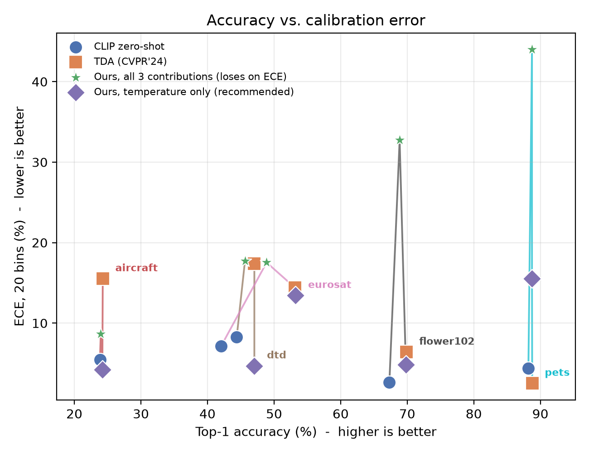

# Calibration-Aware Test-Time Adaptation for CLIP

**Course:** TAU *Deep Learning*, final project
**Authors:** Gal Machlin &middot; Idan Yehuda
**Student IDs:** 207627811 (Gal Machlin), 207016270 (Idan Yehuda)
**Repository:** <https://github.com/macwave12/deep_project_calibration_aware_tta>

---

## What this is

Test-time adaptation (TTA) methods like **TDA** (CVPR 2024) recover a large chunk of the
accuracy CLIP loses out-of-distribution — on our own runs, zero-shot CLIP collapses to
23.9% on Aircraft and 42.1% on EuroSAT, and TDA's forward-pass-only feature cache lifts
both without any backpropagation or labels. A 2025 benchmark (arXiv:2506.24000) showed
this gain has a hidden cost: TDA's cache rewards confident predictions with more
confidence, whether or not they were right, so its accuracy gain comes bundled with a
calibration loss — the benchmark reports average ECE rising 5.70% -> 9.21% across its
suite even as accuracy improves.

We set out to fix that calibration gap **without retraining and without labels**, using
three training-free changes to TDA's cache loop: (1) admit samples to the cache by
top-1/top-2 logit margin instead of entropy, (2) fuse CLIP and cache scores as a
probability mixture instead of summing logits, and (3) pick a softmax temperature by a
label-free leave-one-out (LOO) accuracy estimate. The three are independently
switchable, which is what makes the ablation below possible — and the ablation is where
this project's real finding lives: **the three changes bundled together do not win**,
but one of them, run alone, does. See **Results** for exactly which, and **why**.

## Results

All five datasets, test split only, `ViT-B/16`, `-b 1`, seed `0`, ECE with 20 bins.
Table pasted directly from `results/summary.csv` (`admission_rate` /
`temp_mean` / `temp_frac_at_grid_boundary` are `cal_tda`-only diagnostics — see
**Cache admission and the inert-temperature mechanism** below):

| dataset | method | accuracy | ece | admission_rate | temp_mean | temp_frac_at_grid_boundary |
|---|---|---:|---:|---:|---:|---:|
| dtd | clipzs | 44.39 | 8.27 | — | — | — |
| dtd | tda | 47.04 | 17.41 | — | — | — |
| dtd | cal_tda | 45.63 | 17.72 | 0.5296 | 1.1922 | 0.9882 |
| flower102 | clipzs | 67.32 | 2.63 | — | — | — |
| flower102 | tda | 69.91 | 6.39 | — | — | — |
| flower102 | cal_tda | 68.86 | 32.73 | 0.6569 | 1.0734 | 0.9838 |
| pets | clipzs | 88.20 | 4.37 | — | — | — |
| pets | tda | 88.77 | 2.52 | — | — | — |
| pets | cal_tda | 88.74 | 43.98 | 0.8190 | 1.0383 | 0.9896 |
| eurosat | clipzs | 42.06 | 7.16 | — | — | — |
| eurosat | tda | 53.17 | 14.38 | — | — | — |
| eurosat | cal_tda | 48.88 | 17.53 | 0.2654 | 1.0235 | 1.0000 |
| aircraft | clipzs | 23.85 | 5.44 | — | — | — |
| aircraft | tda | 24.27 | 15.51 | — | — | — |
| aircraft | cal_tda | 23.97 | 8.65 | 0.1593 | 1.0000 | 1.0000 |

**Mean across 5 datasets, from the headline runs above (`results/summary.csv`):**
`clipzs` 53.16% acc / 5.57% ECE &middot; `tda` 56.63% / 11.24% &middot; `cal_tda` (all
three contributions) 55.22% / 24.12%. (The ablation table further below quotes a
separate `tda`-equivalent baseline, run as part of that 40-run sweep rather than this
15-run one; its mean differs very slightly — 56.60% / 11.28% — for reasons explained in
*Floating-point note* below. Both are real, both are labeled, and neither is a typo.)



*The figure plots four points per dataset: the three headline methods from the table
above, plus the ablation's temperature-only variant (purple diamond) — the
configuration this README's verdict actually recommends, not just the three-contribution
bundle it argues against.*

### The honest verdict

The spec's success criterion is: on at least 3 of 5 datasets, `cal_tda` accuracy ≥ `tda`
accuracy **while** `cal_tda` ECE < `tda` ECE.

**`cal_tda` with all three contributions enabled — the method exactly as specified —
meets this criterion on 0 of 5 datasets.** Accuracy is lower than `tda` on every single
dataset (by 0.03 points on Pets up to 4.29 points on EuroSAT), and ECE is *worse* than
`tda` on four of five datasets — dramatically so on Flowers (32.73% vs. 6.39%) and Pets
(43.98% vs. 2.52%). Aircraft is the one dataset where `cal_tda` clearly helps
calibration (8.65% vs. 15.51%). This is a straightforwardly negative result for the
method as originally bundled, and we are reporting it as such rather than reframing it.

**But the ablation (`results/ablation.csv`, 40 runs, all eight on/off combinations of
the three contributions × 5 datasets) shows the criterion *is* achievable — just not by
enabling all three at once.** The right same-code-path comparison for isolating
temperature's effect is against the ablation's own `none` baseline — `cal_tda` with all
three flags off, run inside the same 40-run sweep — not against the separately-run
`tda` rows in the table above: `temp` and `none` differ by exactly one config flag, so
if `temp` ever changed *which* prediction won, that would itself be a bug (temperature
scaling is a monotonic transform of the logits and cannot change an argmax). Against
`none`, `temp` matches accuracy **exactly, to 0.00 points, on all five datasets** — this
is a structural guarantee, not a coincidence — and beats `none`'s ECE on 4 of 5
datasets:

| dataset | TDA-equivalent (ablation `none`) ECE | temp-only ECE | change |
|---|---:|---:|---|
| aircraft | 15.56 | 4.21 | −11.35 |
| dtd | 17.41 | 4.68 | −12.73 |
| eurosat | 14.43 | 13.43 | −1.00 |
| flower102 | 6.51 | 4.85 | −1.66 |
| pets | 2.48 | **15.54** | **+13.06 (worse)** |

Averaged over the five datasets, `temp`-only reaches **11.28% → 8.54% mean ECE** at
*identical* mean accuracy (56.60%) — the best mean ECE of all eight ablation variants,
including "all three" (24.12% mean ECE) and the `none` baseline itself. It is not a
uniform win: on Pets, where TDA is already extremely well calibrated (2.48% ECE), LOO
temperature scaling actively hurts. We report that honestly rather than average it
away.

**Against the headline, separately-run `tda` rows in the results table above (not the
ablation's `none` baseline), the strict count is lower: 2 of 5.** `none` and `tda` are
two different process invocations of what should be identical logic, and in practice
they differ by 0–4 flipped predictions per dataset (see *Floating-point note* below for
why) — enough that `temp`'s accuracy, which is exactly tied to `none` by construction,
sits fractionally below the directly-run `tda` accuracy on flower102, pets and aircraft.
Both counts are reported because they answer different questions: 4/5 answers "does
temperature scaling, holding everything else fixed, help calibration without moving
accuracy" (yes, on 4/5); 2/5 answers "does `temp`-only, run as a real separate process,
beat the specific `tda` numbers quoted at the top of this README" (only on 2/5, because
of run-to-run floating-point drift that is smaller than either result but not zero).

**Margin admission and probabilistic fusion are the two contributions actually
responsible for the full method's failure**, and neither helps consistently on its own
either:

| variant (mean over 5 datasets) | accuracy | ece |
|---|---:|---:|
| TDA-equivalent (all flags off) | 56.60 | 11.28 |
| + margin admission | 53.67 | 18.06 |
| + probabilistic fusion | 55.60 | 24.54 |
| **+ LOO temperature** | **56.60** | **8.54** |
| + margin + fusion | 55.22 | 23.94 |
| + margin + temperature | 53.67 | 19.39 |
| + fusion + temperature | 55.60 | 24.78 |
| All three (ours, as specified) | 55.22 | 24.12 |

Margin admission alone *lowers* mean accuracy (56.60 → 53.67) — its selectivity throws
away cache signal the unfiltered TDA cache was actually using correctly on some
datasets — and raises mean ECE. Probabilistic fusion alone raises mean ECE further
still (24.54%), driven almost entirely by catastrophic blowups on Flowers (32.46%) and
Pets (43.77%) specifically; it happens to *help* Aircraft (15.56% → 9.16%), which is why
"all three" still beats plain TDA on that one dataset. **The full report answer to "does
our method work" is: not as bundled, but its temperature-scaling component alone is a
real, if not universal, calibration improvement — and that is the finding we are
standing behind, not the headline "all three contributions" framing we set out with.**

### Cache admission and the inert-temperature mechanism

`margin_threshold` is one **global** constant (`1.0`), deliberately not tuned per
dataset (per-dataset fitting to test-set margin distributions would be test-set tuning).
Logit margins have no guaranteed common scale across a 10-class dataset (EuroSAT) and a
100-class one (Aircraft), and the five `admission_rate` values above show exactly that
non-portability: from 15.9% admitted (Aircraft, 100 classes — the cache mostly starves)
to 81.9% (Pets, 37 classes — margin admission is nearly a no-op there). Neither extreme
was retuned toward a nicer number; both are reported as measured.

This same table's `temp_frac_at_grid_boundary` column — the fraction of samples whose
LOO-estimated target pins the temperature search at the grid boundary `T=1.0` (wanting
to sharpen further and being prevented by the `T≥1` constraint) — is **98–100% on every
dataset for the full method** (margin + fusion + temperature all on, the `cal_tda` rows
in the table above). The mechanism we suspected during development on DTD alone
generalizes cleanly *for this specific combination*: comparing `margin_fusion`
(temperature off) against `all` (temperature added on top) isolates temperature's
marginal effect once margin **and** fusion are both already active, and it is tiny
everywhere — 0.00 (Aircraft) to 0.36 (Flowers) ECE points, on every one of the 5
datasets — exactly what "98–100% pinned, contribution #3 inert" predicts.

That clean story is specific to temperature-on-top-of-*margin-and-fusion*, though, and
does **not** hold for temperature on top of margin *alone*. Comparing `margin`
(temperature off) against `margin_temp` (temperature added, fusion still off) — i.e.
without fusion's cache-probability averaging in between — shows pinning is
*only* 75–95% for four datasets (DTD 74.6%, Flowers 80.6%, EuroSAT 94.5%, Aircraft
93.5%), not 98%+, and the ECE effect is correspondingly larger: DTD improves by 2.81
points, Flowers by 2.25, EuroSAT and Aircraft barely move. **Pets breaks the pattern
outright**: its `margin_temp` run pins only 0.2% of samples at the boundary — the
opposite of "inert" — and it is exactly on Pets, where TDA was already very well
calibrated (2.53% ECE with margin alone), that adding temperature on top does the most
damage of anywhere in the whole ablation (`margin` 2.53% → `margin_temp` **14.79%**
ECE). The single-dataset DTD evidence pointed at one clean mechanism ("margin makes
temperature inert"); five datasets show that mechanism holds strongly once fusion is
also present, holds more weakly for margin alone, and inverts on Pets — which is
exactly the dataset a DTD-only development story would have missed.

*Floating-point note:* the `tda_equivalent` control (`results/raw/verification/`,
outside `summary.csv`) was only ever run on **DTD** — one file, one dataset — so
"bit-identical on every dataset" cannot be claimed for it; on that one dataset it does
match the directly-run `tda` accuracy exactly. The ablation's `none` variant, which
*was* run on all five datasets, tells the fuller and more honest story: it reproduces
`tda`'s accuracy exactly only on DTD (0 flipped predictions); elsewhere it flips a
handful of individual predictions relative to the directly-run `tda` process —
flower102 −3, eurosat +4, aircraft −2, pets −1, out of 1692–8100 samples per dataset.
ECE likewise matches almost exactly on DTD (17.406% vs. 17.413%, 0.007pp) but drifts
further on the others, up to 0.126pp on flower102 (full per-dataset table: dtd +0.007pp,
pets −0.044pp, eurosat +0.054pp, aircraft +0.052pp, flower102 +0.126pp) — small in
absolute terms, but real, and not the "≤0.1pp everywhere" this section originally
claimed. The cause is not a logic difference between the two code paths: upstream `tda`
accumulates its final logits in fp16, while `cal_tda` (including with every flag off)
upcasts to fp32 before its final step, and at CLIP's logit magnitudes that fp16 rounding
step is worth roughly one ULP ≈ 0.03 — enough, on borderline-margin predictions, to flip
an argmax once every few hundred to few thousand samples (see
`tests/test_cal_tda_runner.py:161-166` for where this is pinned down at the unit-test
level). This is two orders of magnitude smaller than any effect discussed above and does
not change any conclusion in this README, but it is the reason `none`'s numbers and the
directly-run `tda`'s numbers are two distinct, both-correct data points rather than
duplicates of each other.

## Setup

See [`environment.md`](environment.md) for the full, verified setup log (hardware,
exact resolved package versions, GPU smoke test). The one requirement to call out here:
this project's GPU is Blackwell (RTX 5060, `sm_120`), which needs a **CUDA 12.8+
(cu128) build of PyTorch** — older wheels install fine but fail at kernel launch.
`requirements.txt` pins `torch==2.11.0+cu128` / `torchvision==0.26.0+cu128` from
`--extra-index-url https://download.pytorch.org/whl/cu128` accordingly.

```powershell
python -m venv .venv
.\.venv\Scripts\Activate.ps1
pip install -r requirements.txt
```

If local CUDA is unavailable or a run does not fit in 8 GB, use the Colab fallback:
[`notebooks/colab_entry.ipynb`](notebooks/colab_entry.ipynb).

## Data

See [`docs/DATASETS.md`](docs/DATASETS.md) for exact folder layout, sources, and the
per-dataset image counts this project verified against disk. Set the data root before
running anything:

```powershell
$env:DATA_ROOT = "D:\second_degree\deep\data_root"
```

## Reproduce everything

```powershell
.\scripts\run_all.ps1
```

This runs all 15 combinations (5 datasets × `clipzs`/`tda`/`cal_tda`, `ViT-B/16`,
`-b 1`, `-j 0`), then regenerates `results/summary.csv` and every figure under
`analysis/figures/` via `python analysis/aggregate.py` / `python analysis/make_figures.py`
— those two files are script output, not hand-typed. The markdown tables in this README
are transcribed from `results/summary.csv` and `results/ablation.csv` (no script emits
markdown), and every value in them was cross-checked against those CSVs while writing
this section. Took ~41 minutes end-to-end on the RTX 5060
(vs. a ~31 minute pre-run estimate; both are consistent with the measured
~0.02–0.07 s/image throughput in `docs/UPSTREAM_SEAMS.md`).

For the ablation (40 runs, all eight on/off combinations of the three contributions ×
5 datasets, ~2.3 hours end-to-end, matching the pre-run estimate):

```powershell
.\scripts\run_ablation.ps1
```

regenerates `results/ablation.csv` and `report/tables/ablation.tex`.

**Loop-execution note:** both scripts' per-run logic (`scripts/run_one.ps1`) had been
smoke-tested individually before this task but never driven end-to-end by the outer
loop scripts. Running them for real surfaced one invocation-layer defect — not in the
scripts themselves, but in how a first attempt piped their output (`*>&1` merges a
native command's stderr into the success stream in PowerShell 5.1, and with
`$ErrorActionPreference = "Stop"` set inside `run_all.ps1`, an ordinary
`FutureWarning` printed to stderr by PyTorch was enough to abort the whole sweep after
its first run). Re-invoking without merging the streams (`| Tee-Object` on stdout only)
ran clean end to end; `run_all.ps1` and `run_ablation.ps1` themselves needed no code
changes. Separately, two full background sweep processes were killed by the execution
harness itself partway through the 40-run ablation (after roughly the 55–60 minute
mark each time, mid-run, with no error in the run's own log and no GPU/process issue) —
resumed each time by launching only the remaining dataset/variant combinations; all 40
ablation records are present in the final `results/raw/ablation/`.

## What we changed

Three independently-switchable, training-free contributions on top of upstream TDA's
cache loop, all implemented in `online_method/cal_tda.py`:

| # | Change | Function/class | Config flag |
|---|---|---|---|
| 1 | Margin-based cache admission (top-1/top-2 logit gap, instead of entropy) | `margin_score`, `should_admit` in `online_method/cal_tda.py` | `use_margin_admission` (+ `margin_threshold`, global `1.0`) |
| 2 | Probabilistic fusion (convex mixture of CLIP/cache *probabilities*, instead of summed logits) | `probabilistic_fusion` in `online_method/cal_tda.py` | `use_prob_fusion` (+ `fusion_weight`, `0.5`) |
| 3 | Leave-one-out temperature calibration (no ground-truth labels) | `utils/loo_temperature.py` (`loo_accuracy`, `search_temperature`), wired in `online_method/cal_tda.py` | `use_loo_temperature` |

Each is a field on `CalTdaConfig` (`online_method/cal_tda.py`), loaded from the YAML
files under `configs/method/` (`cal_tda.yaml` = all three on; `tda.yaml` /
`tda_equivalent.yaml` = all three off, the control that proves `cal_tda` collapses to
upstream TDA; `configs/method/ablation/*.yaml` = the eight on/off combinations the
ablation sweeps). Runner wiring (registering `cal_tda` as a selectable `--algorithm`,
and the `--config`/`--out-dir`/`--run-name` flags that drive which JSON record a run
writes) is in `online_tta.py`.

## Attribution

This project forks [`TomSheng21/tta-vlm`](https://github.com/TomSheng21/tta-vlm) (the
evaluation framework: CLIP wrapper, dataset loaders, entry points, and the `tda`/
`clipzs` baselines we compare against), reuses cache logic and per-dataset
hyperparameters originally from [`kdiaaa/tda`](https://github.com/kdiaaa/tda) as ported
into that fork, and targets the calibration gap documented by
[arXiv:2506.24000](https://arxiv.org/abs/2506.24000) ("The Illusion of Progress? A
Critical Look at Test-Time Adaptation for Vision-Language Models", NeurIPS 2025), which
also supplies the motivating baseline ECE numbers cited above. Full per-file
upstream/modified/ours breakdown, licenses, and exactly what was taken from where is in
[`NOTICE`](NOTICE); license terms are in [`LICENSE`](LICENSE). Short version:

- **Upstream, unmodified:** `clip/` (except `constants.py`), most of `data/`,
  `instance_method/`, most of `online_method/` (`tda.py`, `clipzs.py`, and the other
  baseline methods we don't use), `utils/tools.py`.
- **Upstream, modified by us:** `clip/constants.py`, `data/datautils.py`,
  `data/fewshot_datasets.py`, `instance_tta.py`, `online_tta.py` (portability fixes
  plus `cal_tda` registration — see `docs/UPSTREAM_SEAMS.md` for the exact seams).
  `online_method/tda.py`'s cache math (originally `kdiaaa/tda`) is read, not modified,
  by `cal_tda.py`.
- **Ours (new):** `online_method/cal_tda.py`; `utils/calibration.py`,
  `utils/loo_temperature.py`, `utils/evaluation.py`; `configs/`; `scripts/`;
  `analysis/`; `tests/`; `docs/`; `environment.md`; `notebooks/`; this README.
